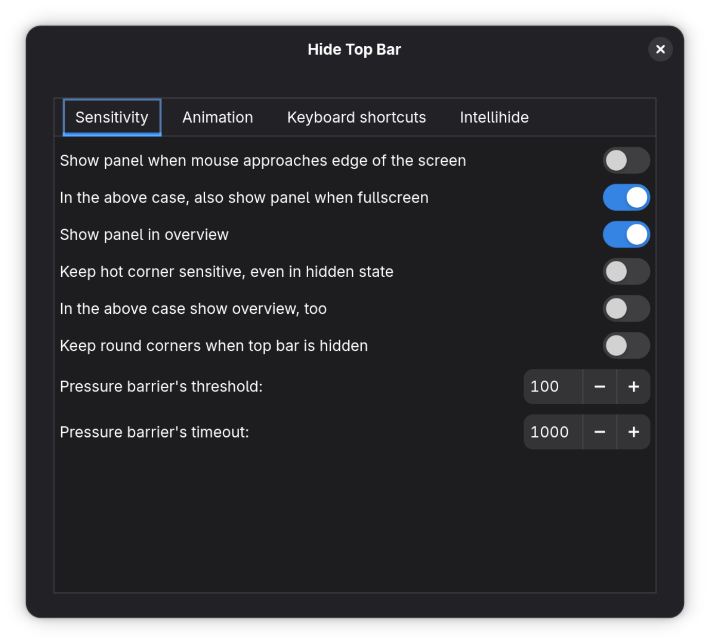
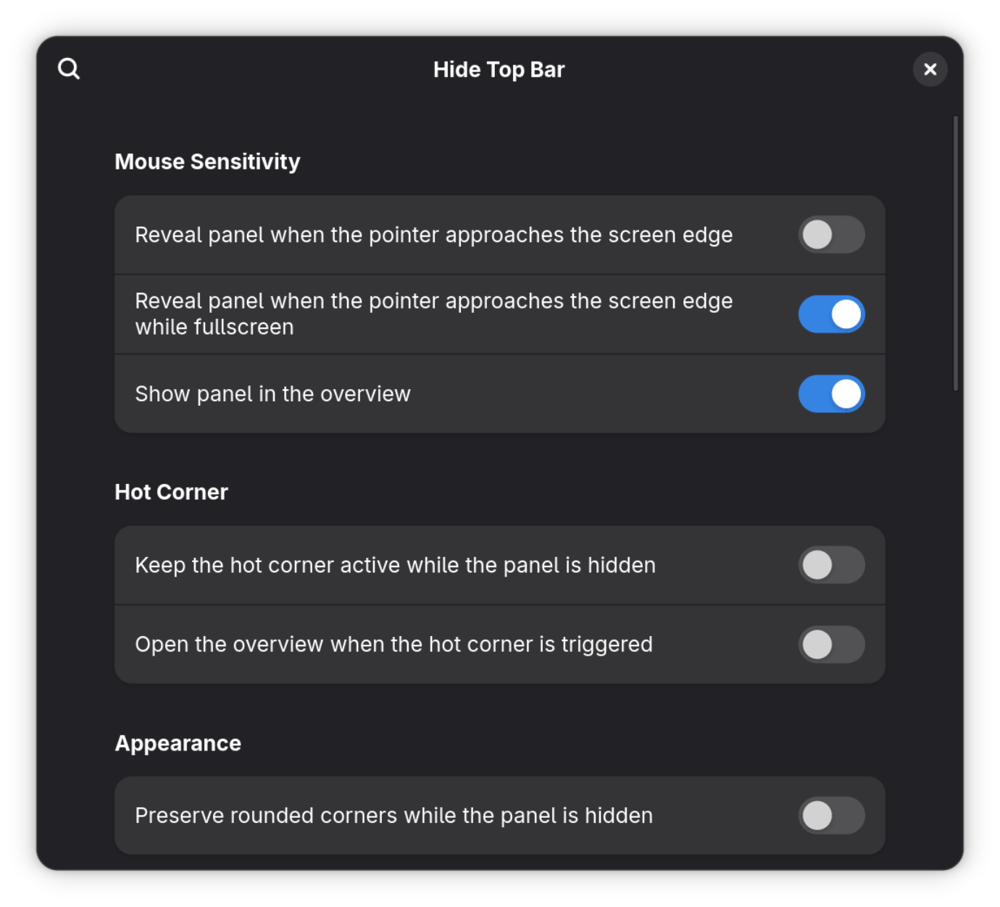

## About

This is a fork of the [Hide Top Bar](https://gitlab.gnome.org/tuxor1337/hidetopbar) GNOME extension with an updated settings UI using libadwaita.

| Before                    | After                   |
|---------------------------|-------------------------|
|  |  |

## Setup

1. Clone the repository, run the setup script, and remove the cloned repository:

   ```sh
   git clone https://github.com/jack-baril/gnome-hide-top-bar-extension.git
   cd gnome-hide-top-bar-extension
   ./setup.sh
   cd ..
   rm -rf gnome-hide-top-bar-extension
   ```

2. Log out of and back into your GNOME session.
3. Enable the extension through the [gnome-extensions-app](https://apps.gnome.org/Extensions/) or the command line:

   ```sh
   gnome-extensions enable hide-top-bar@jack-baril
   ```
